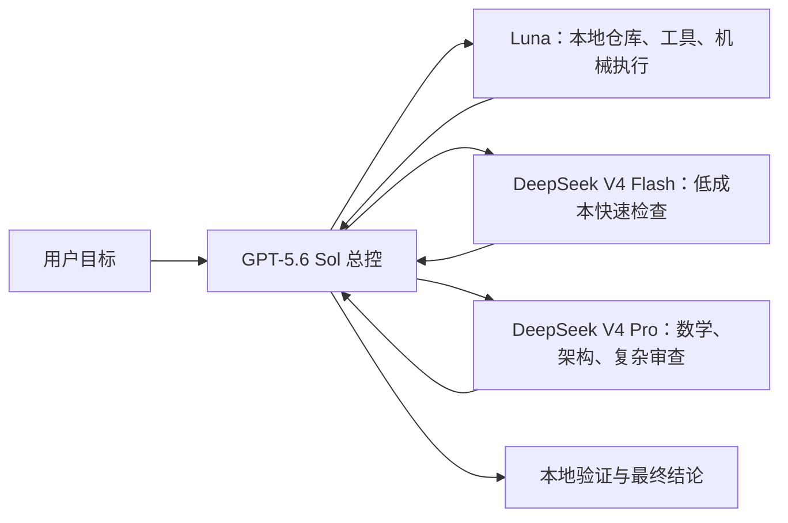
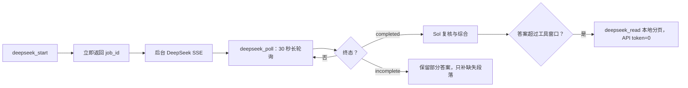

# DeepSeek Codex Router

[English summary](#english-summary)

把 DeepSeek V4 Pro / Flash 部署为 Codex 内部的异步 MCP 专家，并建立清晰的 **Sol 总控、Luna 本地执行、DeepSeek 独立分析** 路由。

这不是一个只修复中文输入的 Bug 包。项目的核心是：

- 将 DeepSeek V4 真正接入 Codex；
- 根据任务类型自动选择 Flash / Pro 与推理强度；
- 由 Sol 保留规划、权限、综合、验证和最终结论；
- 用 30 秒长轮询持续展示任务阶段，避免几分钟黑盒等待；
- 防止思考过程吃光共享输出额度后仍被误判为成功；
- 长答案被 Codex 工具窗口截断时，直接从本地分页续读，不重复调用 API、不重复消耗 DeepSeek token；
- 兼容 Windows PowerShell 5.1 的 UTF-8 / 中文 MCP 输入。

当前版本：`3.4.0-0813-codex-router-budget`。

## 架构与职责



| 角色 | 适合任务 | 不负责 |
| --- | --- | --- |
| Sol | 需求解释、计划、权限、架构取舍、跨 Worker 集成、验证、最终回答 | 不把总控权交给子 Worker |
| Luna | 本地代码搜索、命令、单点修改、批量机械检查、明确可验收执行 | 不做高影响外部发布判断 |
| DeepSeek V4 Flash | 常规独立检查、低成本分析、时延优先任务 | 不假装拥有本地文件或工具 |
| DeepSeek V4 Pro | 数学、算法、架构、复杂调试、对抗审查、关键研究 | 不编排 Luna，也不直接给用户最终结论 |

中文正文的起草、改写、翻译、润色和摘要也优先交给 DeepSeek：常规文字用 Flash，学术、质量优先或关键文字用 Pro；Sol 负责事实核验、整合与最终把关。

服务端 `model=auto` 的主要规则：

- `priority=latency/cost` → Flash；
- `complexity=critical` → Pro；
- 数学、算法、架构、复杂调试、对抗审查、研究 → Pro；
- `chinese_writing / writing / translation / polishing / summarization` → 常规用 Flash，`priority=quality` 或关键任务用 Pro；
- 其他常规任务 → Flash；
- 显式指定 `deepseek-v4-pro` 或 `deepseek-v4-flash` 时尊重用户选择。

## 可见异步调用



公开工具：

- `deepseek_status`：快速检查 API Key 与连接；
- `deepseek_start`：异步启动，立即返回 `job_id`、实际模型和预算；
- `deepseek_poll`：默认每次等待 30 秒，终态提前返回；
- `deepseek_read`：从本地答案文件按字符分页，不调用 DeepSeek API；
- `deepseek_cancel`：取消指定任务；
- `deepseek_consult`：同步兼容入口，不建议用于长任务。

## 输出长度与 token 保护

DeepSeek 推理模型的 `max_tokens` 同时覆盖隐藏推理和最终正文。固定给一个很小的值，可能让大量 token 花在推理上，最后正文为空或被截断。

本项目采用两层保护：

1. **API 输出预算**
   - 普通调用不要填写 `max_tokens`；
   - `thinking=false` 自动使用 16K；
   - `reasoning_effort=high` 自动使用 32K；
   - `reasoning_effort=max` 自动使用 64K；
   - 只有用户明确要求硬成本上限时才显式填写 `max_tokens`，当前可接受范围为 256-384,000；
   - 用 `final_answer_max_chars` 控制最终答案目标长度，默认 12,000 字符，可调 1,000-60,000。

2. **Codex 接收窗口**
   - 单次终态返回最多携带 24,000 个答案字符；
   - 超出时返回 `answer_eof=false` 与 `answer_next_offset`；
   - 继续调用 `deepseek_read` 分页读取本地 `answer.txt`；
   - 本地读取不会产生新 DeepSeek 请求，因此不会因 Codex 工具输出截断而重新付费推理。

若 API 返回 `finish_reason=length`，任务会标为 `INCOMPLETE`，绝不会再显示 `CALL OK`。Sol 应保留已有答案，只在确有缺失时进行一次 `thinking=false` 的定向续写，不自动重跑整道题。

对应的官方接口语义可参考 [DeepSeek Thinking Mode](https://api-docs.deepseek.com/guides/thinking_mode)、[Chat Completions API](https://api-docs.deepseek.com/api/create-chat-completion/) 与 [模型价格/上下文限制](https://api-docs.deepseek.com/quick_start/pricing)。

## 安装 Skill

```powershell
git clone https://github.com/Master-1st/codex-deepseek-visible-stream.git
$skillRoot = Join-Path $env:USERPROFILE '.codex\skills\deepseek-visible-stream'
New-Item -ItemType Directory -Force -Path $skillRoot | Out-Null
Copy-Item -Recurse -Force `
  '.\codex-deepseek-visible-stream\deepseek-visible-stream\*' `
  $skillRoot
```

完全退出并重启 Codex，使新 Skill 生效。

## 部署 DeepSeek MCP

交互安装：

```powershell
.\codex-deepseek-visible-stream\deepseek-visible-stream\scripts\Install-DeepSeek-Visible-Stream-Hotfix3.cmd
```

自动安装：

```powershell
$env:DEEPSEEK_INSTALL_NO_GUI = '1'
powershell.exe -NoProfile -ExecutionPolicy Bypass -File `
  '.\codex-deepseek-visible-stream\deepseek-visible-stream\scripts\Install-DeepSeek-Visible-Stream-Hotfix3.ps1'
```

安装器文件名保留 `Hotfix3` 是为了兼容已有安装与升级路径；安装后的产品身份是 **DeepSeek Codex Router 3.4**。

安装器会：

- 备份现有 `server.ps1`、`stream-worker.ps1` 与 `config.toml`；
- 写入 DeepSeek MCP server / worker；
- 只替换带标签的 DeepSeek MCP 配置块；
- 为 `deepseek_start`、`deepseek_poll`、`deepseek_read` 等工具设置自动批准；
- 若发现 `sol-multi-worker-orchestrator`，幂等更新 DeepSeek 路由说明；
- 不写入、不输出、也不提交 `DEEPSEEK_API_KEY`。

安装后必须完全退出并重启 Codex / ChatGPT，旧 MCP 长驻进程不会自动热重载。

## 验证

先运行两个完全不调用 DeepSeek API 的测试：

```powershell
powershell.exe -NoProfile -ExecutionPolicy Bypass -File `
  '.\codex-deepseek-visible-stream\deepseek-visible-stream\scripts\Test-Utf8-Input-Regression.ps1'

powershell.exe -NoProfile -ExecutionPolicy Bypass -File `
  '.\codex-deepseek-visible-stream\deepseek-visible-stream\scripts\Test-Control-Plane-Contract.ps1'
```

第二个测试覆盖：路由说明、30 秒轮询 schema、动态预算、`INCOMPLETE` 处理与 `deepseek_read` 本地分页。

然后重启 Codex，调用 `deepseek_status`。配置 API Key 后，可选择运行一次真实低成本流式集成测试：

```powershell
powershell.exe -NoProfile -ExecutionPolicy Bypass -File `
  '.\codex-deepseek-visible-stream\deepseek-visible-stream\scripts\Test-DeepSeek-Visible-Streaming.ps1'
```

## Windows UTF-8 兼容性

PowerShell 5.1 的 stdin 可能按系统代码页（中文环境常见 CP936）解释，而 MCP 发送 UTF-8 JSON-RPC。旧式 `[Console]::In.ReadLine()` 可能把中文请求破坏为：

```text
id=null
error.code=-32700
message=Parse error
```

Router 直接读取 stdin 原始字节，按 LF 分帧后使用 UTF-8 解码。这个兼容层保证中文提示能够进入路由与任务创建，但它只是完整产品的一部分。

## 安全

- 仓库不包含任何 API Key、job 请求、聊天记录或运行日志；
- 不要把 `.codex` 配置、jobs 目录或环境变量导出到公开仓库；
- 不展示 DeepSeek 原始 `reasoning_content`，只显示阶段和计数；
- 不批量终止所有 PowerShell 进程，取消任务时只处理已确认 PID。

## English summary

DeepSeek Codex Router deploys DeepSeek V4 Pro and Flash as asynchronous MCP specialists inside Codex. Sol remains the controller and final verifier, Luna handles local execution, Flash handles low-cost checks, and Pro handles high-rigor analysis. The router uses 30-second visible polling, dynamic shared output budgets, explicit `finish_reason=length` handling, and a local `deepseek_read` paging tool so host-side output clipping never requires another paid DeepSeek inference. Its Windows PowerShell 5.1 transport also decodes raw UTF-8 MCP input correctly.

## License

MIT
